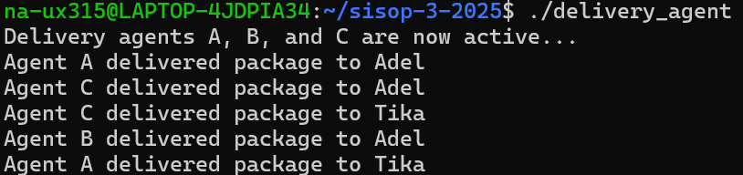
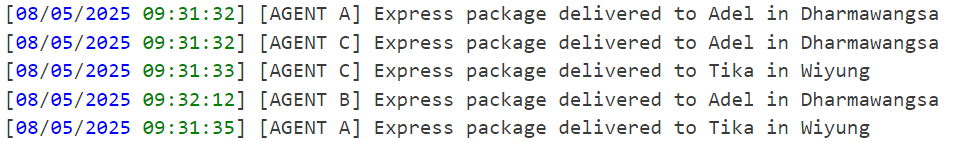
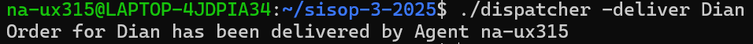
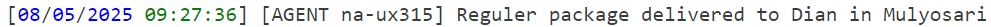
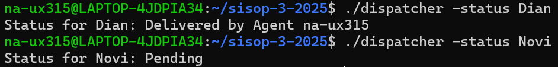

# Sisop-3-2025-IT34
Member :
1. Christiano Ronaldo Silalahi (5027241025)
2. Naila Cahyarani Idelia (5027241063)
3. Daniswara Fausta Novanto (5027241050)


# Soal Modul 3

### a. Membuat struktur dan mendownlaod file yang akan didecrypt


pertama, kita membuat struktur terlebih dahulu seperti di soal dengan cara :
```bash
mkdir -p soal_1
cd soal_1

mkdir -p client/secrets
touch client/image_client  

mkdir -p server/database
touch server/image_server  
touch server/server.log   

touch image_server.c     # File source code server
touch image_client.c     # File source code client

chmod +x client/image_client
chmod +x server/image_server
```

kedua, unduh file zip menggunakan perintah berikut:

```bash
wget --no-check-certificate "https://drive.usercontent.google.com/u/0/uc?id=15mnXpYUimVP1F5Df7qd_Ahbjor3o1cVw&export=download" -O secrets.zip
```

selanjutnya, unzip file tersebut dengan

```bash
unzip -q secrets.zip -d client/secrets/ 
```

Tampilannya akan menjadi seperti ini


### b. Menjalankan Server sebagai Daemon dan Menggunakan Socket RPC

```bash
pid_t pid = fork();
if (pid < 0) {
    exit(EXIT_FAILURE);
}
if (pid > 0) {
    exit(EXIT_SUCCESS); 
}

umask(0); 
```

- fork() membuat proses child
- Parent process di-terminate (exit), child process melanjutkan eksekusi
- umask(0) mengatur permission file yang dibuat server

Socket RPC Set Up :

```bash
int server_fd = socket(AF_INET, SOCK_STREAM, 0);
address.sin_family = AF_INET;
address.sin_addr.s_addr = INADDR_ANY;
address.sin_port = htons(PORT);

bind(server_fd, (struct sockaddr *)&address, sizeof(address));
listen(server_fd, 3);
```
- AF_INET: IPv4
- SOCK_STREAM: TCP
- INADDR_ANY: Terima koneksi dari semua interface
- PORT 8080: Port yang digunakan


</div>
## Soal 2

### a.

Pertama, unduh file CSV menggunakan perintah berikut:

```bash
wget --no-check-certificate "https://drive.google.com/uc?export=download&id=1OJfRuLgsBnIBWtdRXbRsD2sG6NhMKOg9" -O delivery_order.csv
```

Kemudian, periksa isi file CSV yang telah diunduh dengan `cat delivery_order.csv`

### b.

Buat sebuah *file* delivery_agent.c untuk agen otomatis pengantar Express

```bash
$ delivery_agent.c 
```

Delivery_agent.c mensimulasikan agen pengiriman yang mencari pesanan dengan jenis "Express" yang berstatus "Pending" dan kemudian mengubah statusnya menjadi "Delivered". Berikut adalah codenya

```bash
#include <stdio.h>
#include <stdlib.h>
#include <string.h>
#include <unistd.h>
#include <pthread.h>
#include <fcntl.h>
#include <sys/mman.h>
#include <sys/stat.h>
#include <time.h>
#include <errno.h>

#define SHARED_MEMORY_NAME "/delivery_orders"
#define LOG_FILE "delivery.log"
#define MAX_ORDERS 100
#define NUM_AGENTS 3

typedef struct {
    char name[50];
    char address[100];
    char type[20];
    char status[50];
    time_t order_time;
} Order;

typedef struct {
    pthread_mutex_t mutex;  // Mutex buat sinkronisasi akses shared memory
    Order orders[MAX_ORDERS];
    int count;
} SharedData;
```
- Fungsi format_time:

```bash
void format_time(char *buffer, size_t size, time_t t) {
    struct tm *local = localtime(&t);
    strftime(buffer, size, "%d/%m/%Y %H:%M:%S", local);
} 
```

- Fungsi write_log:

```bash
void write_log(const char *agent, const char *type, const char *name, const char *address) {
    FILE *log = fopen(LOG_FILE, "a");
    if (!log) {
        perror("Failed to open log file");
        return;
    }
    char timebuf[32];
    time_t now = time(NULL);
    format_time(timebuf, sizeof(timebuf), now);
    fprintf(log, "[%s] [AGENT %s] %s package delivered to %s in %s\n",
            timebuf, agent, type, name, address);
    fclose(log);
}
```

Fungsi yang mirip dengan log_delivery di dispatcher.c, tetapi menerima karakter agent sebagai argumen.

- Fungsi load_orders_from_csv:

```bash
void load_orders_from_csv(SharedData *shared_data) {
    FILE *file = fopen("delivery_order.csv", "r");
    if (!file) {
        perror("Failed to open delivery_order.csv");
        exit(EXIT_FAILURE);
    }

    char line[256];
    fgets(line, sizeof(line), file); 

    pthread_mutex_lock(&shared_data->mutex);
    shared_data->count = 0;

    while (fgets(line, sizeof(line), file)) {
        if (shared_data->count >= MAX_ORDERS) {
            printf("Warning: Maximum order capacity reached\n");
            break;
        }
        Order *order = &shared_data->orders[shared_data->count];
        char *token = strtok(line, ",");
        if (!token) continue;
        strncpy(order->name, token, sizeof(order->name));
        token = strtok(NULL, ",");
        if (!token) continue;
        strncpy(order->address, token, sizeof(order->address));
        token = strtok(NULL, ",\n");
        if (!token) continue;
        strncpy(order->type, token, sizeof(order->type));
        strcpy(order->status, "Pending");
        order->order_time = time(NULL);
        shared_data->count++;
    }

    pthread_mutex_unlock(&shared_data->mutex);
    fclose(file);
}
```

Fungsi ini memuat pesanan dari CSV ke shared memory. Perhatikan bahwa akses ke shared_data dilindungi oleh mutex untuk menghindari konflik jika ada agen yang sedang membaca data pada saat yang sama.

- Fungsi agent_thread:

```bash
void *agent_thread(void *arg) {
    char agent_name = *(char *)arg;

    // Buka shared memory
    int shm_fd = shm_open(SHARED_MEMORY_NAME, O_RDWR, 0666);
    if (shm_fd == -1) {
        perror("shm_open in agent");
        pthread_exit(NULL);
    }

    SharedData *shared_data = mmap(NULL, sizeof(SharedData), PROT_READ | PROT_WRITE, MAP_SHARED, shm_fd, 0);
    if (shared_data == MAP_FAILED) {
        perror("mmap in agent");
        close(shm_fd);
        pthread_exit(NULL);
    }

    srand(time(NULL) ^ (agent_name << 8)); 

    while (1) {
        pthread_mutex_lock(&shared_data->mutex);
        int found = 0;
        for (int i = 0; i < shared_data->count; i++) {
            if (strcmp(shared_data->orders[i].type, "Express") == 0 &&
                strcmp(shared_data->orders[i].status, "Pending") == 0) {
                pthread_mutex_unlock(&shared_data->mutex);
                sleep(1 + rand() % 3);
                pthread_mutex_lock(&shared_data->mutex);

                // Update status
                snprintf(shared_data->orders[i].status, sizeof(shared_data->orders[i].status),
                         "Delivered by Agent %c", agent_name);

                // Log
                write_log(&agent_name, "Express", shared_data->orders[i].name, shared_data->orders[i].address);

                printf("Agent %c delivered package to %s\n", agent_name, shared_data->orders[i].name);
                found = 1;
                break; 
            }
        }
        pthread_mutex_unlock(&shared_data->mutex);

        if (!found) {
            sleep(1);
        }
    }

    munmap(shared_data, sizeof(SharedData));
    close(shm_fd);
    pthread_exit(NULL);
}
```

- Fungsi main:

```bash
int main() {
        int shm_fd = shm_open(SHARED_MEMORY_NAME, O_CREAT | O_RDWR, 0666);
        if (shm_fd == -1) {
            perror("shm_open");
            exit(EXIT_FAILURE);
        }
        if (ftruncate(shm_fd, sizeof(SharedData)) == -1) {
            perror("ftruncate");
            close(shm_fd);
            exit(EXIT_FAILURE);
        }
    
        SharedData *shared_data = mmap(NULL, sizeof(SharedData), PROT_READ | PROT_WRITE, MAP_SHARED, shm_fd, 0);
        if (shared_data == MAP_FAILED) {
            perror("mmap");
            close(shm_fd);
            exit(EXIT_FAILURE);
        }
    
        static pthread_mutexattr_t mutex_attr;
        static int mutex_initialized = 0;
        if (!mutex_initialized) {
            pthread_mutexattr_init(&mutex_attr);
            pthread_mutexattr_setpshared(&mutex_attr, PTHREAD_PROCESS_SHARED);
            pthread_mutex_init(&shared_data->mutex, &mutex_attr);
            mutex_initialized = 1;
        }
    
        pthread_mutex_lock(&shared_data->mutex);
        int need_load = (shared_data->count == 0);
        pthread_mutex_unlock(&shared_data->mutex);
    
        if (need_load) {
            load_orders_from_csv(shared_data);
        }
    
        pthread_t agents[NUM_AGENTS];
        char agent_names[NUM_AGENTS] = {'A', 'B', 'C'};
    
        for (int i = 0; i < NUM_AGENTS; i++) {
            if (pthread_create(&agents[i], NULL, agent_thread, &agent_names[i]) != 0) {
                perror("Failed to create agent thread");
                munmap(shared_data, sizeof(SharedData));
                close(shm_fd);
                exit(EXIT_FAILURE);
            }
        }
    
        printf("Delivery agents A, B, and C are now active...\n");
    
        for (int i = 0; i < NUM_AGENTS; i++) {
            pthread_join(agents[i], NULL);
        }
    
        munmap(shared_data, sizeof(SharedData));
        close(shm_fd);
        shm_unlink(SHARED_MEMORY_NAME);
    
        return 0;
    }
```

Coba program dan compile terlebih dahulu dengan `gcc delivery_agent.c -o delivery_agent.c -lpthread`

Untuk menjalankan pengiriman bertipe express menggunakan `./delivery_agent`


Setelah sukses mengantar, kita lihat log di delivery.log


### c.

Buat sebuah *file* dispatcher.c untuk pengiriman dan monitoring pesanan oleh user

```bash
$ dispatcher.c
```

Berikut adalah codenya

```bash
#include <stdio.h>
#include <stdlib.h>
#include <string.h>
#include <unistd.h>
#include <fcntl.h>
#include <sys/mman.h>
#include <sys/stat.h>
#include <sys/types.h>
#include <time.h>
#include <sys/wait.h>

#define SHARED_MEMORY_NAME "/delivery_orders"
#define LOG_FILE "delivery.log"
#define MAX_ORDERS 100

typedef struct {
    char name[50];
    char address[100];
    char type[20];
    char status[50];
    time_t order_time;
} Order;

typedef struct {
    Order orders[MAX_ORDERS];
    int count;
} OrderList;
```

- Fungsi file_exists:

```bash
int file_exists(const char *filename) {
    return access(filename, F_OK) == 0;
}
```

Fungsi ini memeriksa apakah suatu file ada.

- Fungsi download_csv_if_needed:

```bash
void download_csv_if_needed() {
    if (!file_exists("delivery_order.csv")) {
        printf("Downloading delivery_order.csv...\n");
        int result = system("wget -q --show-progress --no-check-certificate "
                            "'https://drive.google.com/uc?export=download&id=1OJfRuLgsBnIBWtdRXbRsD2sG6NhMKOg9' "
                            "-O delivery_order.csv");
        if (result != 0) {
            fprintf(stderr, "Download failed with code %d\n", result);
        }
    }
}
```

Fungsi ini mengunduh file delivery_order.csv dari Google Drive jika file tersebut belum ada.

- Fungsi format_time:

```bash
void format_time(char *buffer, size_t size, time_t t) {
    struct tm *local = localtime(&t);
    strftime(buffer, size, "%d/%m/%Y %H:%M:%S", local);
}
```

Fungsi ini memformat waktu dalam format dd/mm/yyyy HH:MM:SS untuk keperluan logging.

- Fungsi log_delivery:

```bash
void log_delivery(const char *agent, const char *type, const char *name, const char *address) {
    FILE *log = fopen(LOG_FILE, "a");
    if (log == NULL) {
        perror("Failed to open log file");
        return;
    }
    char timebuf[32];
    time_t now = time(NULL);
    format_time(timebuf, sizeof(timebuf), now);
    fprintf(log, "[%s] [AGENT %s] %s package delivered to %s in %s\n",
            timebuf, agent, type, name, address);
    fclose(log);
}
```

Fungsi ini mencatat informasi pengiriman ke dalam file delivery.log.

- Fungsi load_orders_from_csv:

```bash
void load_orders_from_csv(OrderList *order_list) {
    FILE *file = fopen("delivery_order.csv", "r");
    if (file == NULL) {
        perror("Failed to open delivery_order.csv");
        exit(1);
    }
    char line[256];
    fgets(line, sizeof(line), file); // Skip header
    order_list->count = 0;
    while (fgets(line, sizeof(line), file)) {
        if (order_list->count >= MAX_ORDERS) {
            printf("Warning: Maximum order capacity reached\n");
            break;
        }
        Order *order = &order_list->orders[order_list->count];
        char *token = strtok(line, ",");
        if (!token) continue;
        strncpy(order->name, token, sizeof(order->name));
        token = strtok(NULL, ",");
        if (!token) continue;
        strncpy(order->address, token, sizeof(order->address));
        token = strtok(NULL, ",\n");
        if (!token) continue;
        strncpy(order->type, token, sizeof(order->type));
        strcpy(order->status, "Pending");
        order->order_time = time(NULL);
        order_list->count++;
    }
    fclose(file);
}
```

Fungsi ini membaca data pesanan dari file delivery_order.csv dan menyimpannya ke dalam struktur OrderList. Setiap baris dalam CSV diasumsikan berisi nama, alamat, dan jenis pesanan, dipisahkan oleh koma. Baris pertama dianggap sebagai header dan diabaikan.

- Fungsi list_orders:

```bash
void list_orders(OrderList *order_list) {
    printf("All Orders:\n");
    printf("-------------------------------------------------\n");
    printf("%-20s %-20s %-30s\n", "Name", "Type", "Status");
    printf("-------------------------------------------------\n");
    for (int i = 0; i < order_list->count; i++) {
        printf("%-20s %-20s %-30s\n",
               order_list->orders[i].name,
               order_list->orders[i].type,
               order_list->orders[i].status);
    }
    printf("-------------------------------------------------\n");
}
```

Fungsi ini menampilkan daftar semua pesanan yang ada di shared memory.

- Fungsi check_status:

```bash
void check_status(OrderList *order_list, const char *name) {
    for (int i = 0; i < order_list->count; i++) {
        if (strcmp(order_list->orders[i].name, name) == 0) {
            printf("Status for %s: %s\n", name, order_list->orders[i].status);
            return;
        }
    }
    printf("No order found for %s\n", name);
}
```

Fungsi ini mencari pesanan berdasarkan nama dan menampilkan statusnya.

- Fungsi deliver_order:

```bash
void deliver_order(OrderList *order_list, const char *name, const char *agent) {
    for (int i = 0; i < order_list->count; i++) {
        if (strcmp(order_list->orders[i].name, name) == 0 &&
            strcmp(order_list->orders[i].status, "Pending") == 0) {
            snprintf(order_list->orders[i].status, sizeof(order_list->orders[i].status),
                     "Delivered by Agent %s", agent);
            log_delivery(agent, order_list->orders[i].type, order_list->orders[i].name, order_list->orders[i].address);
            printf("Order for %s has been delivered by Agent %s\n", name, agent);
            return;
        }
    }
    printf("No pending order found for %s\n", name);
}
```

Fungsi ini menandai pesanan dengan nama tertentu sebagai 'Delivered' oleh agen yang ditentukan, dan mencatatnya dalam file log.

- Fungsi main:

```bash
int main(int argc, char *argv[]) {

    download_csv_if_needed();

    // Buat shared memory POSIX
    int shm_fd = shm_open(SHARED_MEMORY_NAME, O_CREAT | O_RDWR, 0666);
    if (shm_fd == -1) {
        perror("shm_open");
        return 1;
    }
    ftruncate(shm_fd, sizeof(OrderList));
    OrderList *order_list = mmap(NULL, sizeof(OrderList), PROT_READ | PROT_WRITE, MAP_SHARED, shm_fd, 0);
    if (order_list == MAP_FAILED) {
        perror("mmap");
        return 1;
    }

    if (order_list->count == 0) {
        load_orders_from_csv(order_list);
    }

    if (argc < 2) {
        printf("Usage:\n");
        printf("  ./dispatcher -deliver [Name]\n");
        printf("  ./dispatcher -status [Name]\n");
        printf("  ./dispatcher -list\n");
        munmap(order_list, sizeof(OrderList));
        close(shm_fd);
        return 1;
    }

    if (strcmp(argv[1], "-list") == 0) {
        list_orders(order_list);
    } else if (strcmp(argv[1], "-status") == 0 && argc == 3) {
        check_status(order_list, argv[2]);
    } else if (strcmp(argv[1], "-deliver") == 0 && argc == 3) {
        const char *agent = getenv("USER");
        if (!agent) agent = "UNKNOWN";
        deliver_order(order_list, argv[2], agent);
    } else {
        printf("Invalid command\n");
    }

    munmap(order_list, sizeof(OrderList));
    close(shm_fd);
    // shm_unlink(SHARED_MEMORY_NAME);

    return 0;
}
```

Coba program dan compile terlebih dahulu dengan `gcc dispatcher.c -o dispatcher -lpthread`

Untuk mengantar order Reguler dengan memberikan perintah deliver dari dispatcher menggunakan `./dispatcher -deliver [Nama]`


Setelah sukses mengantar, kita lihat log di delivery.log


### d.

Untuk mengecek status setiap pesanan menggunakan `./dispatcher -status [Nama]`


### e.

Untuk melihat semua order disertai nama dan statusnya menggunakan `./dispatcher -list`
.png)

## Soal 4

### a.

Buat sebuah *file* system.c dan hunter.c

```bash
$ system.c 
```

```bash
$ hunter.c 
```

### b.

Berikut adalah kode untuk fitur registrasi dan login

```bash
void register_hunter() {
    char name[MAX_NAME_LENGTH];
    printf("Masukkan nama: ");
    scanf(" %[^\n]", name); // Perbaikan di sini
    
    for (int i = 0; i < MAX_HUNTERS; i++) {
        if (!hunters[i].used) {
            strncpy(hunters[i].name, name, MAX_NAME_LENGTH);
            hunters[i].level = 1;
            hunters[i].exp = 0;
            hunters[i].atk = 10;
            hunters[i].hp = 100;
            hunters[i].def = 5;
            hunters[i].banned = 0;
            hunters[i].notify = 0;
            hunters[i].used = 1;
            hunters[i].key = 1000 + rand() % 9000;
            me = &hunters[i];
            printf("Berhasil registrasi sebagai %s. Key kamu: %d\n", name, me->key);
            return;
        }
    }
    printf("Pendaftaran gagal, kapasitas penuh.\n");
}

void login() {
    int key;
    printf("Masukkan key: ");
    scanf("%d", &key);
    
    for (int i = 0; i < MAX_HUNTERS; i++) {
        if (hunters[i].used && hunters[i].key == key) {
            if (hunters[i].banned) {
                printf("Hunter ini dibanned!\n");
                return;
            }
            me = &hunters[i];
            printf("Login berhasil sebagai %s\n", me->name);
            return;
        }
    }
    printf("Login gagal.\n");
}
```

### c. 

Berikut adalah kode untuk menampilkan informasi hunter

```bash
void print_hunters() {
    pthread_mutex_lock(&lock);
    printf("\n=== List Hunter Terdaftar ===\n");
    int found = 0;
    for (int i = 0; i < MAX_HUNTERS; i++) {
        if (hunters[i].used) {
            found = 1;
            printf("Name: %s | Lv: %d | EXP: %d | ATK: %d | HP: %d | DEF: %d | %s\n",
                hunters[i].name, hunters[i].level, hunters[i].exp, hunters[i].atk,
                hunters[i].hp, hunters[i].def,
                hunters[i].banned ? "[BANNED]" : "");
        }
    }
    if (!found) printf("Tidak ada hunter terdaftar.\n");
    pthread_mutex_unlock(&lock);
}
```

### d. 

Berikut adalah kode untuk generate dungeon secara random

```bash
void generate_dungeon() {
    pthread_mutex_lock(&lock);
    for (int i = 0; i < MAX_DUNGEONS; i++) {
        if (!dungeons[i].used) {
            dungeons[i].used = 1;
            // Contoh nama dungeon acak dari daftar
            const char *names[] = {"Demon Castle", "Bramak Mountain", "Rad Gate", "Dark Forest", "Ice Cave"};
            strcpy(dungeons[i].name, names[rand() % 5]);

            dungeons[i].min_level = (rand() % 5) + 1;
            dungeons[i].atk_reward = 100 + rand() % 51;
            dungeons[i].hp_reward = 50 + rand() % 51;
            dungeons[i].def_reward = 25 + rand() % 26;
            dungeons[i].exp_reward = 150 + rand() % 151;
            dungeons[i].key = 10000 + rand() % 90000;
            printf("[INFO] Dungeon baru dibuat: %s (Min Level: %d)\n", dungeons[i].name, dungeons[i].min_level);
            break;
        }
    }
    pthread_mutex_unlock(&lock);
}

void *dungeon_generator_thread(void *arg) {
    while (1) {
        generate_dungeon();
        sleep(10);
    }
    return NULL;
}
```

### e.

Berikut adalah kode untuk fitur yang menampilkan informasi detail semua dungeon

```bash
void print_dungeons() {
    pthread_mutex_lock(&lock);
    printf("\n=== List Dungeon Tersedia ===\n");
    int found = 0;
    for (int i = 0; i < MAX_DUNGEONS; i++) {
        if (dungeons[i].used) {
            found = 1;
            printf("Key: %d | Name: %s | Min Level: %d | +ATK %d | +HP %d | +DEF %d | +EXP %d\n",
                dungeons[i].key, dungeons[i].name, dungeons[i].min_level,
                dungeons[i].atk_reward, dungeons[i].hp_reward,
                dungeons[i].def_reward, dungeons[i].exp_reward);
        }
    }
    if (!found) printf("Tidak ada dungeon tersedia.\n");
    pthread_mutex_unlock(&lock);
}
```

### f. 

Berikut adalah kode untuk fitur yang menampilkan semua dungeon yang tersedia sesuai dengan level hunter

```bash
void list_available_dungeons() {
    printf("\n=== Dungeon untuk %s (Level %d) ===\n", me->name, me->level);
    int count = 0;
    
    for (int i = 0; i < MAX_DUNGEONS; i++) {
        if (dungeons[i].used && dungeons[i].min_level <= me->level) {
            printf("%d. Key: %d | %s [Lv %d] [+%d ATK, +%d HP, +%d DEF, +%d EXP]\n",
                ++count, dungeons[i].key, dungeons[i].name, dungeons[i].min_level,
                dungeons[i].atk_reward, dungeons[i].hp_reward,
                dungeons[i].def_reward, dungeons[i].exp_reward);
        }
    }
    
    if (count == 0) {
        printf("Tidak ada dungeon yang tersedia untuk level Anda.\n");
    }
}
```

### g.

Berikut adalah kode untuk menguasai dungeon dan mendapatkan stat rewards

```bash
void raid_dungeon() {
    list_available_dungeons();
    
    int key;
    printf("Masukkan key dungeon: ");
    scanf("%d", &key);
    
    for (int i = 0; i < MAX_DUNGEONS; i++) {
        if (dungeons[i].used && dungeons[i].key == key && dungeons[i].min_level <= me->level) {
            me->atk += dungeons[i].atk_reward;
            me->hp += dungeons[i].hp_reward;
            me->def += dungeons[i].def_reward;
            me->exp += dungeons[i].exp_reward;
            
            printf("\nRaid sukses! Stat baru:\n");
            printf("ATK: %d (+%d)\n", me->atk, dungeons[i].atk_reward);
            printf("HP: %d (+%d)\n", me->hp, dungeons[i].hp_reward);
            printf("DEF: %d (+%d)\n", me->def, dungeons[i].def_reward);
            printf("EXP: %d (+%d)\n", me->exp, dungeons[i].exp_reward);
            
            if (me->exp >= 500) {
                me->exp = 0;
                me->level++;
                printf("\nLevel up! Sekarang level %d\n", me->level);
            }
            
            dungeons[i].used = 0;
            return;
        }
    }
    printf("Dungeon tidak valid atau level kurang.\n");
}
```

###  h. 

### i. 

Berikut adalah kode untuk fitur ban/unban hunter

```bash
void ban_unban_hunter() {
    char name[MAX_NAME_LENGTH];
    printf("Masukkan nama hunter untuk ban/unban: ");
    scanf("%s", name);

    pthread_mutex_lock(&lock);
    for (int i = 0; i < MAX_HUNTERS; i++) {
        if (hunters[i].used && strcmp(hunters[i].name, name) == 0) {
            hunters[i].banned = !hunters[i].banned;
            printf("Hunter %s telah %s.\n", name, hunters[i].banned ? "dibanned" : "diunban");
            pthread_mutex_unlock(&lock);
            return;
        }
    }
    printf("Hunter tidak ditemukan.\n");
    pthread_mutex_unlock(&lock);
}
```

### j.

Berikut adalah kode untuk fitur reset

```bash
void reset_hunter() {
    char name[MAX_NAME_LENGTH];
    printf("Masukkan nama hunter untuk reset: ");
    scanf("%s", name);

    pthread_mutex_lock(&lock);
    for (int i = 0; i < MAX_HUNTERS; i++) {
        if (hunters[i].used && strcmp(hunters[i].name, name) == 0) {
            hunters[i].level = 1;
            hunters[i].exp = 0;
            hunters[i].atk = 10;
            hunters[i].hp = 100;
            hunters[i].def = 5;
            hunters[i].banned = 0;
            printf("Hunter %s telah direset ke stats awal.\n", name);
            pthread_mutex_unlock(&lock);
            return;
        }
    }
    printf("Hunter tidak ditemukan.\n");
    pthread_mutex_unlock(&lock);
}
```

### k.

### l. 

Berikut adalah kode untuk menghapus semua shared memory saat sistem dimatikan

```bash
void cleanup(int signum) {
    pthread_mutex_destroy(&lock);

    int shmid_hunters = shmget(shm_key_hunters, 0, 0666);
    if (shmid_hunters >= 0) {
        shmctl(shmid_hunters, IPC_RMID, NULL);
    }
    int shmid_dungeons = shmget(shm_key_dungeons, 0, 0666);
    if (shmid_dungeons >= 0) {
        shmctl(shmid_dungeons, IPC_RMID, NULL);
    }
    printf("\n[INFO] Semua shared memory telah dihapus. Program keluar.\n");
    exit(0);
}
```
